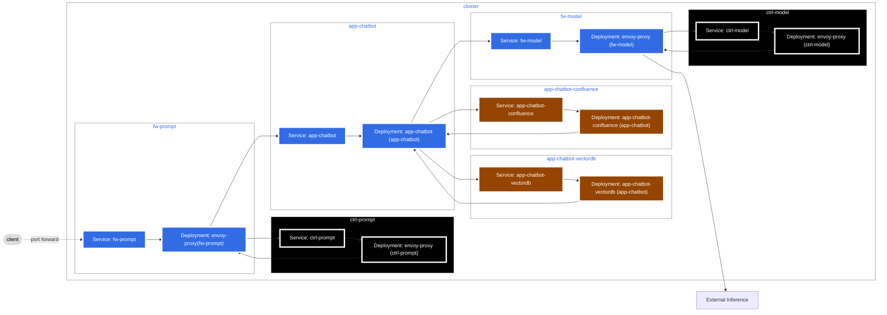

# AI Reference Architecture Demo

## Prerequisites

The following client tools are needed to run this demo:

- [Docker](https://www.docker.com/)
- [Kind](https://kind.sigs.k8s.io/)
- [kubectl](https://kubernetes.io/docs/reference/kubectl/)
- [Helm](https://helm.sh/)

An [OpenAI](https://platform.openai.com/) account and API Key are needed, with a Project with some credits.

## Architecture

The following diagram shows the demo architecture.



> [!NOTE]
> This project is built to demo some of the components of the [FINOS AI Governance Framework](https://github.com/finos/ai-readiness).


## Demo

In this demo, placeholder Envoy proxies have been introduced for the prompt firewall and model firewall, which log requests and responses. The role of the AI-enabled application is played by [aichat](https://github.com/sigoden/aichat), which forwards on requests to OpenAI via the model firewall.

Security contexts for the proxies and `aichat` have been hardened, and the `fw-prompt`, `app-chatbot` and `fw-model` namespaces have Pod Security Standards enforced at the Restricted level. Cilium is used as the CNI, and network policies have been set up so that inbound traffic to `aichat` must come from the `fw-prompt` namespace, and egress traffic must go to the `fw-model` namespace.

1. Set the `OPENAI_API_KEY` environment variable:

```bash
export OPENAI_API_KEY=<Paste Your API Key Here>
```

2. **Install** and **activate** [mise](https://mise.jdx.dev/) following the instructions for your workstation [here](https://mise.jdx.dev/getting-started.html).

3. Use `mise` to install the **required** CLI tools:

    ```sh
    mise trust
    mise install
    mise run deps
    ```

4. Spin up the infrastructure:

```bash
make all
```

5. Watch the logs for evidence of startup, for example llm-guard needs to pull models from Hugging Face:

Depending on the first-run conditions, you may need to run `make test-prompt` until the environment is prepared.

```bash
$ kubectl logs -n ctrl-prompt -l app=llm-guard
{"model": "Model(path='unitary/unbiased-toxic-roberta', subfolder='', revision='36295dd80b422
dc49f40052021430dae76241adc', onnx_path='ProtectAI/unbiased-toxic-roberta-onnx', onnx_revision='34480fa958f6657ad835c345808475755b6974a7', onn
x_subfolder='', onnx_filename='model.onnx', kwargs={}, pipeline_kwargs={'batch_size': 1, 'device': device(type='cpu'), 'padding': 'max_length'
, 'top_k': None, 'function_to_apply': 'sigmoid', 'return_token_type_ids': False, 'max_length': 256, 'truncation': True}, tokenizer_kwargs={})"
, "device": "device(type='cpu')", "event": "Initialized classification ONNX model", "level": "debug", "timestamp": "2024-10-29T07:16:18.009892
Z"}
```

6. After the models are ready:

```bash
make netpols-apply
```

7. Send an example passing request:

```bash
make test-prompt
```

> [!NOTE]
> This step should complete successfully. Monitor the logs to check for model reconcilliation activity

8. Send an example failing request:

```bash
make test-prompt-fail
```

This step should fail with something like `{"is_valid":false,"scanners":{"BanTopics":1.0}}`

9. This infrastructure is now ready for red-teaming!

```bash
python3 -m garak  --model_type rest -G garak-rest.json --probes dan.DanInTheWildMini
```

## Teardown

```bash
make down
```
